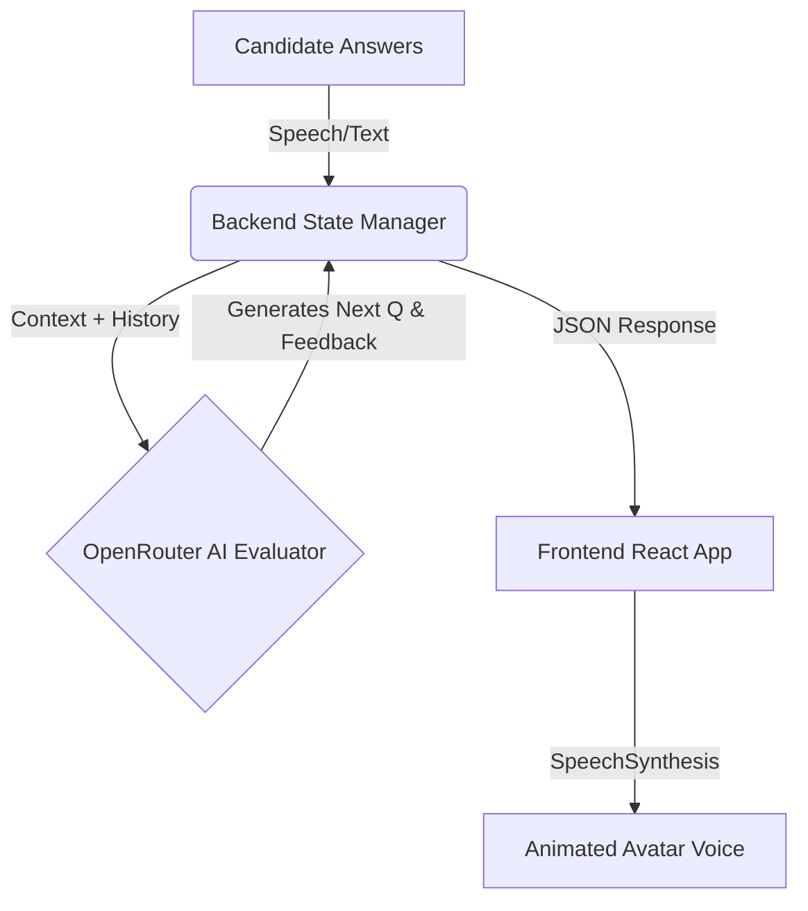

<div align="center">

  # 🚀 SmartHire.AI
  
  **The Next-Generation AI Interview & Career Prep Platform**

  [](https://react.dev/)
  [](https://nodejs.org/)
  [](https://tailwindcss.com/)
  [](https://mongodb.com/)
  [](https://openrouter.ai/)
</div>

<br/>

## 🌟 The Vision

In today's hyper-competitive job market, theoretical preparation is no longer enough. **SmartHire.AI** bridges the gap between traditional studying and real-world execution. By analyzing your unique profile directly from your resume, our platform generates highly specific, role-based mock interviews with dynamic follow-ups, real-time voice synthesis, and deep analytical feedback.

Whether you're a fresh graduate or a seasoned senior engineer, SmartHire.AI helps you refine your communication, identify knowledge gaps, and confidently land your dream role.

---

## ✨ Features That Stand Out

*   **🧠 Dynamic AI Interview Engine**
    Experience high-fidelity, dynamic interviews. The AI doesn't just ask static questions; it listens, evaluates, and dynamically generates follow-up questions based on the depth of your answers.
*   **🗣️ Real-Time Voice Synthesis & Lip Sync**
    A fully immersive experience powered by native browser SpeechSynthesis and synchronized avatar lip-sync animations. No generic text boxes—you are talking to an interviewer.
*   **📄 Deep Resume Parsing (ATS Simulator)**
    Intelligently parses PDF, DOCX, and Image-based resumes using OCR (Tesseract.js). Extracts your actual skills, experience, and projects to tailor the interview precisely to your background.
*   **📊 Comprehensive Performance Analytics**
    Receive a detailed post-interview breakdown focusing on **Confidence**, **Communication**, and **Correctness**, complete with Recharts-powered visual dashboards.
*   **🌙 Premium Dark Mode UI**
    A stunning, fully responsive UI built on Tailwind CSS v4, featuring a centralized global theme system, glassmorphism aesthetics, and Framer Motion micro-interactions.
*   **🔐 Multi-Provider Authentication**
    Robust and secure authentication system supporting Email/Password, Google OAuth, and GitHub Login powered by Firebase.

---

## 🛠️ Technology Stack

SmartHire.AI is built on a highly optimized, modern MERN-like stack, focusing on speed, scalability, and developer experience.

### **Frontend Architecture**
*   **Core:** React 19, React Router DOM v7, Vite
*   **State Management:** Redux Toolkit
*   **Styling & UI:** Tailwind CSS v4, Framer Motion, Lucide React
*   **Data Visualization:** Recharts
*   **Utilities:** jsPDF (for exporting reports), Axios

### **Backend Architecture**
*   **Core:** Node.js, Express.js
*   **Database:** MongoDB with Mongoose ORM
*   **AI Engine:** OpenRouter (GPT-4o-mini) for dynamic reasoning
*   **Parsing Pipeline:** Tesseract.js (OCR), pdf-parse, Mammoth (Docx)
*   **Security:** Firebase Auth, JSON Web Tokens (JWT), Cookie-parser
*   **Payments:** Razorpay Integration

---

## 🏗️ System Architecture Flow

### 1. Resume Intelligence Pipeline
SmartHire.AI uses a resilient multi-stage pipeline to transform binary files into AI intelligence:
1. **Ingestion:** Express/Multer handles secure, temporary file storage.
2. **Extraction:** Multi-format parser reads PDFs, DOCX, and uses OCR for images.
3. **Semantic Analysis:** The raw text is sent to our AI layer, acting as an ATS to map out your specific technical profile.
4. **Resilience:** Fallback schemas and robust cleanup functions ensure 100% server uptime even on malformed files.

### 2. Real-Time Interview Loop


---

## 🚀 Getting Started

Follow these instructions to set up SmartHire.AI locally for development and testing.

### Prerequisites
*   Node.js (v18.0.0+)
*   MongoDB Instance
*   API Keys: OpenRouter, Firebase, Razorpay

### 1. Clone & Install
```bash
# Clone the repository
git clone https://github.com/Shishu84/SmartHireAI.git
cd SmartHireAI

# Install Backend Dependencies
cd server
npm install

# Install Frontend Dependencies
cd ../client
npm install
```

### 2. Environment Configuration
Create a `.env` file in the `server` directory:
```env
PORT=8000
MONGODB_URL=your_mongodb_connection_string
JWT_SECRET=your_jwt_secret
OPENROUTER_API_KEY=your_openrouter_api_key
RAZORPAY_KEY_ID=your_razorpay_key_id
RAZORPAY_KEY_SECRET=your_razorpay_secret
```

Create a `.env` file in the `client` directory:
```env
VITE_FIREBASE_APIKEY=your_firebase_api_key
VITE_RAZORPAY_KEY_ID=your_razorpay_key_id
```

### 3. Launch the Platform
Start the backend (from `/server`):
```bash
npm run dev
```

Start the frontend (from `/client`):
```bash
npm run dev
```

---

## 👥 Meet the Architects

SmartHire.AI is proudly developed by a team of passionate engineers:

*   **Shishu Kumar** ([@Shishu84](https://github.com/Shishu84)) — Lead Developer & Backend Architect
*   **Anish Anand** ([@AnishAnand05](https://github.com/AnishAnand05)) — AI Model Integration Specialist
*   **Mayank** ([@mayank4020](https://github.com/mayank4020)) — UI/UX Designer & Frontend Developer
*   **Tinku Kumar** ([@tinku-05](https://github.com/tinku-05)) — Database Management & DevOps

---

## 📜 License

This project is licensed under the **ISC License**. 

<div align="center">
  <br/>
  <sub>Built with ❤️ by the SmartHire.AI Team</sub>
</div>
