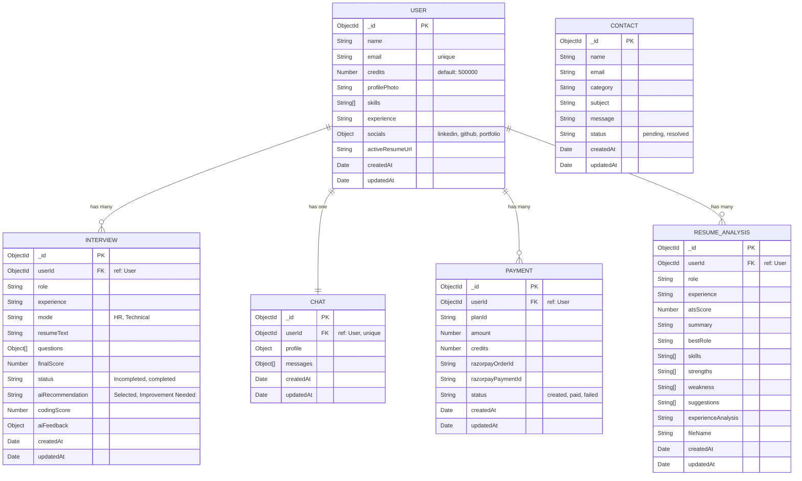

# SmartHire AI - Entity Relationship Diagram (ERD)

This document outlines the MongoDB collections, their schemas, and the relationships between them for the SmartHire AI application.

## Entity Relationship Diagram

## Collections Breakdown

### 1. User
The core entity representing an authenticated user on the platform.
*   **Relationships**:
    *   One-to-Many with **Interview**
    *   One-to-One with **Chat** (persistent thread per user)
    *   One-to-Many with **Payment**
    *   One-to-Many with **ResumeAnalysis**

### 2. Interview
Represents an AI interview session taken by a user.
*   **Relationships**:
    *   Many-to-One with **User** (via `userId`)
*   **Key Fields**:
    *   `questions`: Array of sub-documents containing the question, answer, difficulty, time limit, and detailed scoring (score, confidence, communication, correctness).
    *   `aiFeedback`: Structured object containing overall feedback, technical/behavioral feedback, strengths, improvements, and actionable suggestions.

### 3. Chat
Stores the persistent conversational history and context for the AI Assistant.
*   **Relationships**:
    *   One-to-One with **User** (via `userId`)
*   **Key Fields**:
    *   `messages`: Array of message sub-documents containing role (`user`, `assistant`, `system`) and content.
    *   `profile`: Cached context (role, experience, skills, resume summary) used for personalized responses.

### 4. Payment
Records transactions for purchasing credits or plans via Razorpay.
*   **Relationships**:
    *   Many-to-One with **User** (via `userId`)
*   **Key Fields**:
    *   Stores `razorpayOrderId` and `razorpayPaymentId` for payment gateway reconciliation.

### 5. ResumeAnalysis
Stores the results of AI-powered resume parsing and ATS scoring.
*   **Relationships**:
    *   Many-to-One with **User** (via `userId`)
*   **Key Fields**:
    *   `atsScore`: The calculated ATS compatibility score.
    *   Detailed arrays for `skills`, `strengths`, `weakness`, and `suggestions`.

### 6. Contact
Stores support inquiries and messages sent via the contact form.
*   **Relationships**:
    *   Independent collection (no explicit foreign keys).
