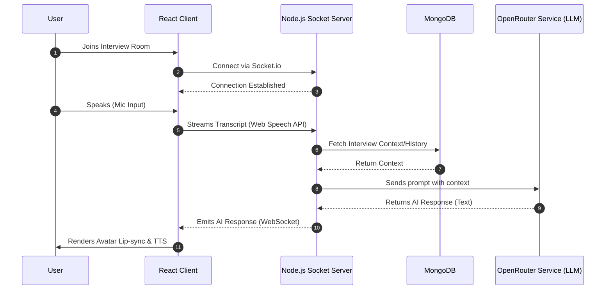
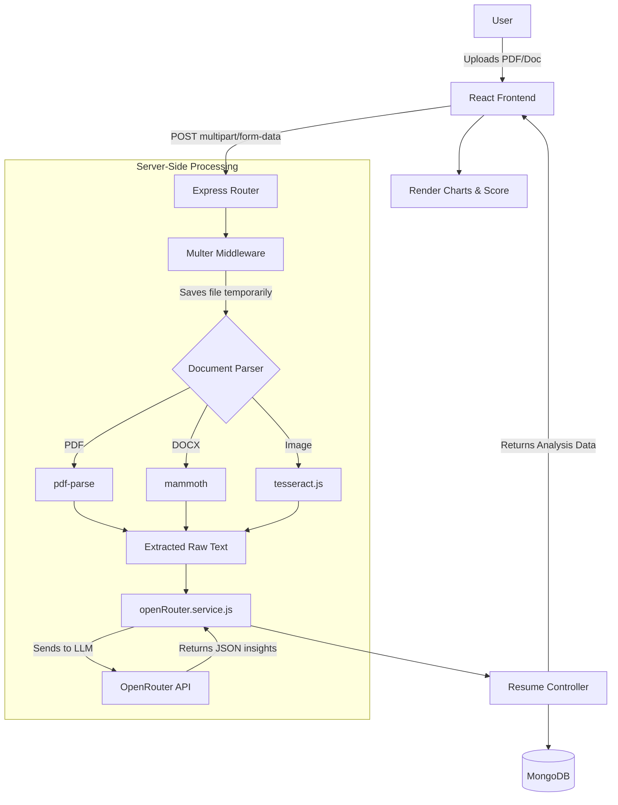
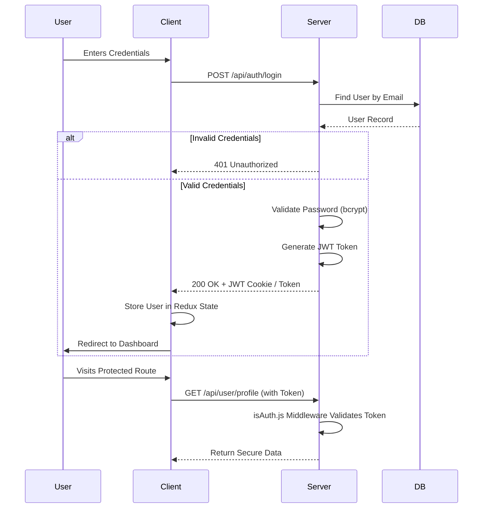

# SmartHireAI - System Flowcharts

This document visualizes the different interaction flows between the Client (Frontend) and Server (Backend) using Mermaid diagrams.

## 1. Overall System Architecture Flow

This flowchart illustrates the general RESTful interaction between the React frontend, the Express backend, and the MongoDB database.

```mermaid
graph TD
    %% Entities
    Client[React Frontend / Vite]
    Express[Express.js Server]
    DB[(MongoDB)]

    %% Connections
    Client <-->|REST API Requests \n (Axios)| Express
    
    subgraph Backend Server
        Express --> Auth[Auth Controller]
        Express --> User[User Controller]
        Express --> Resume[Resume Controller]
        Express --> Payment[Payment Controller]
        Express --> Interview[Interview Controller]
        
        Auth <--> DB
        User <--> DB
        Resume <--> DB
        Payment <--> DB
        Interview <--> DB
    end
```

## 2. Real-Time Avatar Interview Flow (WebSockets)

This sequence diagram explains the low-latency, bi-directional communication required for the live AI avatar interview room.



## 3. Resume Analysis Pipeline

This flowchart outlines the process of how a user's resume is uploaded, parsed, analyzed by AI, and returned to the client.



## 4. Authentication Flow

A breakdown of the JWT-based login and session management workflow.


