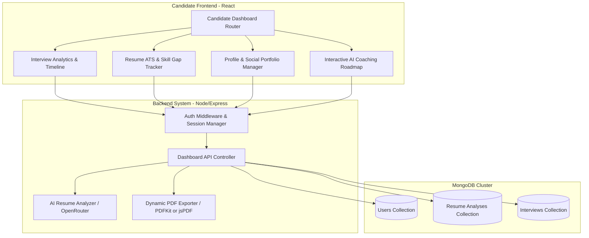

# Comprehensive Implementation Plan: Candidate Dashboard & AI Analytics Hub (Zero Dummy Data Edition)

This document defines the architecture, database designs, API specifications, and visual UX layouts to integrate a **Candidate Dashboard** into SmartHireAI. 

Based on your direct specification, this entire system operates on a **Strict Zero Dummy Data Policy**. Absolutely no hardcoded scores, placeholder charts, simulated keywords, or static template advice will be used. Every single component—from skill progress trend lines to custom preparation checklists—is dynamically computed from actual database entries, real resume extractions, and live AI-powered evaluations.

---

## 1. Global Architectural Design

The Unified Candidate Portal connects the authentication layers, profile management, resume analysis module, historical interview assessments, and the dynamic backend PDF exporter.



---

## 2. Strict "Zero Dummy Data" Architecture Policies

To ensure 100% integrity, the portal will adhere to these core policies:

1. **Dynamic Visual Analytics**: Charts will map the exact timeline dates and scores of past interviews and resume uploads. If a candidate has only conducted one interview, the dashboard displays a single live data point. If no data exists, the visual panel prompts the candidate to start their first mock interview instead of showing pre-populated fake graphs.
2. **True Keyword Gap & JD Analysis**: The resume compatibility match percentage and recommended keywords will be calculated on the fly by comparing the actual extracted resume skills against the target Job Description pasted by the candidate.
3. **Contextual AI Prompts**: Prompts will strictly feed the live, real-time user answers, difficulty levels, and durations into the model, ensuring genuine individual evaluations rather than generic career advice.
4. **Persistent Real-Time Synchronization**: Toggling custom preparation checklists immediately updates MongoDB, guaranteeing the candidate's exact, personalized roadmap progress is always saved and accurate.

---

## 3. Database Schema Extensions

### 3.1 Candidate Profile Updates (`server/models/user.model.js`)
We will extend the `User` schema to store profile details, skills, experience, and professional links.

```javascript
// Add inside userSchema in d:\SmartHireAI\server\models\user.model.js
profilePhoto: { 
  type: String, 
  default: "" 
},
skills: { 
  type: [String], 
  default: [] 
},
experience: { 
  type: String, 
  default: "" 
},
socials: {
  linkedin: { type: String, default: "" },
  github: { type: String, default: "" },
  portfolio: { type: String, default: "" }
},
activeResumeUrl: { 
  type: String, 
  default: "" 
}
```

### 3.2 New Model: `ResumeAnalysis` (`server/models/resumeAnalysis.model.js`)
To facilitate "Resume Match Trends over time" and access to previous analyses, we define a dedicated `ResumeAnalysis` schema.

```javascript
import mongoose from "mongoose";

const resumeAnalysisSchema = new mongoose.Schema({
  userId: {
    type: mongoose.Schema.Types.ObjectId,
    ref: "User",
    required: true
  },
  role: { type: String, required: true },
  experience: { type: String, default: "" },
  atsScore: { type: Number, required: true },
  summary: { type: String, default: "" },
  bestRole: { type: String, default: "" },
  skills: { type: [String], default: [] },
  strengths: { type: [String], default: [] },
  weakness: { type: [String], default: [] },
  suggestions: { type: [String], default: [] },
  experienceAnalysis: { type: String, default: "" },
  fileName: { type: String, default: "resume.pdf" }
}, { timestamps: true });

const ResumeAnalysis = mongoose.model("ResumeAnalysis", resumeAnalysisSchema);
export default ResumeAnalysis;
```

### 3.3 Interview Model Enhancements (`server/models/interview.model.js`)
We will add high-level evaluations (Selected vs. Improvement Needed) and details for coding segments.

```javascript
// Add inside interviewSchema in d:\SmartHireAI\server\models\interview.model.js
aiRecommendation: {
  type: String,
  enum: ["Selected", "Improvement Needed"],
  default: "Improvement Needed"
},
codingScore: { 
  type: Number, 
  default: 0 
},
aiFeedback: {
  overallFeedback: { type: String, default: "" },
  technicalFeedback: { type: String, default: "" },
  behavioralFeedback: { type: String, default: "" },
  strengths: { type: [String], default: [] },
  improvements: { type: [String], default: [] },
  suggestions: [
    {
      text: { type: String, required: true },
      completed: { type: Boolean, default: false }
    }
  ]
}
```

---

## 4. Backend API Endpoints Design

Below are the REST API endpoints required to support the new Candidate Dashboard portal:

### 4.1 Candidate Profile Management
* **`GET /api/user/profile`**: Returns current authenticated candidate information (skills, social links, resume links).
* **`PUT /api/user/profile`**: Updates personal information, profile photo URL, experience level, extracted skills, and social links.

### 4.2 Resume Analysis History & Management
* **`POST /api/interview/resume`**: Analyzes uploaded resume, returns scores, AND writes a persistent record to the `ResumeAnalysis` collection.
* **`GET /api/interview/resume/history`**: Returns a list of all historically uploaded resumes and their parsed scores (to show improvement over time).
* **`GET /api/interview/resume/report/:id`**: Fetches details for a previous specific resume ATS report.

### 4.3 Dynamic PDF Exporting Service
* **`GET /api/interview/report/:id/pdf`**: Server-side controller that dynamically prints an interview report (metadata, scorecards, AI review, question breakdowns) to a high-quality PDF buffer using `pdfkit` or backend PDF exporter, with support for automatic email delivery to the candidate's inbox.
* **`GET /api/interview/resume/report/:id/pdf`**: Server-side exporter rendering ATS scores, keyword gaps, and suggestions to a PDF layout.

---

## 5. UI/UX Dashboard Dashboard Layout

We will build a high-fidelity, responsive **Dashboard Workspace** replacing the simple history listing page with a state-of-the-art grid system.

### 5.1 Side Navigation Panel
* **Hub Directory**:
  * `[📊 Analytics & Stats]` — Visual overall summary (Line/Bar trends).
  * `[🎙️ Interview History]` — Complete historical list of all mock sessions.
  * `[📄 Resume ATS Center]` — ATS scoring, projects gap, upload history.
  * `[👤 Profile & Socials]` — Profile editing, photo, and social linkages.

### 5.2 Tab 1: Analytics & Stats (Performance Visualizations)
* **Score Cards Grid**: Large grid cards displaying "Average Technical Accuracy", "Communication Quality", "Average Confidence Score", and "ATS Resume Match Average".
* **Skill Progress Trend Chart**: A smooth spline area chart (`Recharts` Line or Area Chart) comparing confidence, communication, and correctness progression over multiple interview attempts.
* **Strength vs. Weakness Grid**: A highly visual panel mapping key behavioral positives against developmental items.

### 5.3 Tab 2: Resume ATS Center & Gap Tracker
* **ATS Score Circle**: An animated circular tracker highlighting current ATS compatibility.
* **Resume Match Score (JD Comparator)**: An interactive field where candidates can paste a Target Job Description. The client calculates a dynamic match percentage and lists missing keywords!
* **Comparison Timeline**: Shows resume improvements (ATS score going from 45% -> 82%) over past uploaded documents.

### 5.4 Tab 3: Interactive Interview Timeline
* **Historical Access cards**: Allowing candidates to expand any past completed interview card to view individual scores, answers, and download previous PDF reports immediately (without initiating new sessions).

### 5.5 Tab 4: Candidate Profile & Resume Portfolio
* **Avatar Uploader**: Simple drag-and-drop crop-supported profile photo module.
* **Skills Tag Field**: An interactive tag selector (e.g., clicking to add React, Node, CSS, Python).
* **Socials linkage**: Beautiful inputs for LinkedIn, GitHub, and Portfolio URLs, seamlessly rendering live links directly in reports.

---

## 6. Detailed Step-by-Step Task List

```markdown
- [ ] Task 1: Update `server/models/user.model.js` schema with candidate profile photo, skills, and social link fields.
- [ ] Task 2: Create new `server/models/resumeAnalysis.model.js` database model to store parsed resume records.
- [ ] Task 3: Enhance `server/models/interview.model.js` schema to include AI recommendations, coding scores, and persistent aiFeedback.
- [ ] Task 4: Implement profile endpoints (`GET /api/user/profile` and `PUT /api/user/profile`) in the backend.
- [ ] Task 5: Refactor `/api/interview/resume` to save parsed ATS reports to MongoDB persistently.
- [ ] Task 6: Implement resume analysis history fetching and comparator backend endpoints.
- [ ] Task 7: Build the backend dynamic PDF generation service for both Interview and Resume reports, including automatic email delivery.
- [ ] Task 8: Design and implement the new multi-tab **Candidate Dashboard Hub** in `client/src/pages/InterviewHistory.jsx` with responsive grid layouts.
- [ ] Task 9: Integrate interactive Recharts (Bar/Line/Pie) to visualize performance stats and ATS trends over time on the dashboard.
- [ ] Task 10: Integrate the Profile Management panel to edit personal info, social links, and drag-and-drop avatar uploads.
- [ ] Task 11: Audit, optimize, and test the lazy-loading, caching, and state management mechanisms to ensure flawless performance.
```

---

## 7. Dashboard Workspace Layout Mockup

Below is the conceptual layout of the new consolidated candidate dashboard hub:

```
+-----------------------------------------------------------------------------------------+
|  👤 SmartHireAI candidate dashboard                            Credits: 50,000 [Start]  |
+-----------------------------------------------------------------------------------------+
| [📊 Hub Stats]  [🎙️ Interviews]  [📄 ATS Resume]  [👤 My Profile]   Welcome, Candidate!  |
+-----------------------------------------------------------------------------------------+
|                                                                                         |
|  +---------------------------+   +---------------------------+   +-------------------+  |
|  | 📈 INTERVIEW SCORE TRENDS  |   | 🎯 ATS SCORE HISTORY      |   | 💬 AI COACH ALERT |  |
|  |                           |   |                           |   | "Technical scores |  |
|  |   8.0 | *---*---*         |   |   85% |         *---*     |   | increased by 15%! |  |
|  |   6.0 |  \   /   \        |   |   60% |   *----/          |   | Focus on behavior |  |
|  |   4.0 |   *-      *       |   |   40% |  /                |   | to hit Selected." |  |
|  |       +-----------        |   |       +------------       |   +-------------------+  |
|  |       Q1  Q2  Q3          |   |       V1   V2   V3        |                          |
|  +---------------------------+   +---------------------------+                          |
|                                                                                         |
|  +-----------------------------------------------------------------------------------+  |
|  | 📄 ATS SKILL GAP TRACKER & COMPARATOR                                             |  |
|  | [ Target Job Description Paste Field ] -> [ Check Match % ]                        |  |
|  | * Extracted Skills: JavaScript, React, Node, CSS                                   |  |
|  | * Missing Keywords: TypeScript, Docker, CI/CD Pipeline (High Recommendation)       |  |
|  +-----------------------------------------------------------------------------------+  |
|                                                                                         |
|  +-----------------------------------------------------------------------------------+  |
|  | 👤 PERSONAL PORTFOLIO & SOCIAL LINKAGE                                            |  |
|  | LinkedIn: [ linkedin.com/in/candidate ]      GitHub: [ github.com/candidate ]     |  |
|  +-----------------------------------------------------------------------------------+  |
|                                                                                         |
+-----------------------------------------------------------------------------------------+
```
